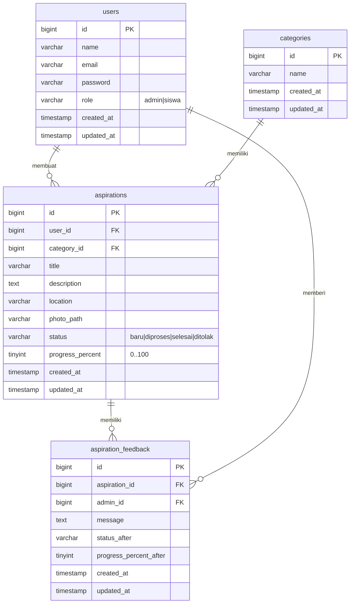

# ERD (Entity Relationship Diagram)

Berikut ERD untuk **Aplikasi Pengaduan Sarana Sekolah**.

```mermaid
erDiagram
  users ||--o{ aspirations : membuat
  categories ||--o{ aspirations : memiliki
  aspirations ||--o{ aspiration_feedback : memiliki
  users ||--o{ aspiration_feedback : memberi

  users {
    bigint id PK
    varchar name
    varchar email
    varchar password
    varchar role  "admin|siswa"
    timestamp created_at
    timestamp updated_at
  }

  categories {
    bigint id PK
    varchar name
    timestamp created_at
    timestamp updated_at
  }

  aspirations {
    bigint id PK
    bigint user_id FK
    bigint category_id FK
    varchar title
    text description
    varchar location
    varchar photo_path
    varchar status  "baru|diproses|selesai|ditolak"
    tinyint progress_percent "0..100"
    timestamp created_at
    timestamp updated_at
  }

  aspiration_feedback {
    bigint id PK
    bigint aspiration_id FK
    bigint admin_id FK
    text message
    varchar status_after
    tinyint progress_percent_after
    timestamp created_at
    timestamp updated_at
  }
```

